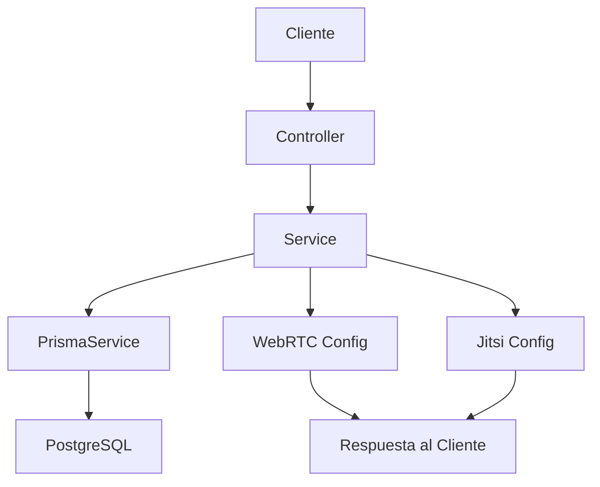
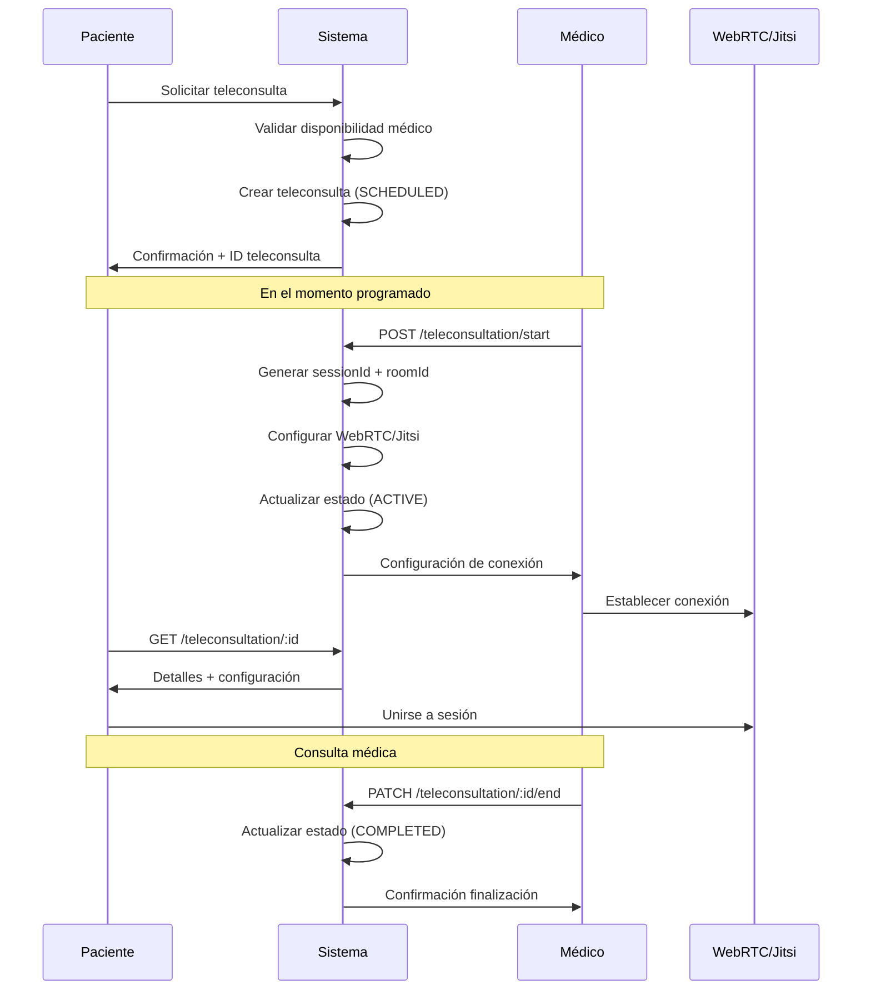
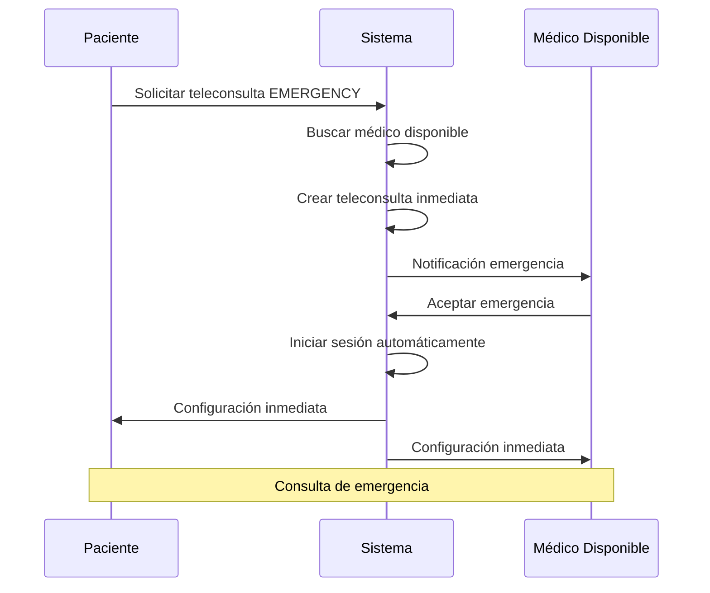

# 🎥 Módulo de Teleconsultas - Documentación Técnica

## Resumen Ejecutivo

El módulo de teleconsultas implementa una solución completa de telemedicina **100% gratuita** para el portal web de coordinación de citas y teleasistencia. Utiliza exclusivamente WebRTC nativo para proporcionar videoconsultas médicas de alta calidad sin costos adicionales.

## 🎯 Objetivos del Módulo

### Necesidades Cubiertas
- ✅ Teleconsultas médicas sin costo
- ✅ Integración con sistema de citas existente
- ✅ Soporte para consultas de emergencia
- ✅ Gestión completa del ciclo de vida de teleconsultas
- ✅ Seguridad y privacidad de datos médicos

### Beneficios Clave
- **Costo cero**: Sin licencias ni infraestructura adicional
- **Escalabilidad**: Soporta crecimiento sin costos incrementales
- **Interoperabilidad**: Compatible con sistemas EHR existentes
- **Experiencia de usuario**: Interfaz intuitiva para médicos y pacientes

## 🏗️ Arquitectura del Sistema

### Componentes Principales

```
teleconsultation/
├── dto/
│   ├── create-teleconsultation.dto.ts    # Validaciones de entrada
│   └── start-session.dto.ts              # Configuración de sesión
├── teleconsultation.controller.ts        # Endpoints REST
├── teleconsultation.service.ts           # Lógica de negocio
├── teleconsultation.module.ts            # Configuración del módulo
└── README.md                             # Documentación técnica
```

### Flujo de Datos



## 📡 API Endpoints

### Endpoints Principales (Solicitados)

#### **POST /teleconsultation/start**
**Propósito**: Iniciar sesión de teleconsulta con configuración automática.

**Parámetros**:
- `teleconsultationId` (number): ID de la teleconsulta programada
- `preferredType` (enum): 'webrtc' | 'jitsi' | 'emergency'
- `deviceInfo` (string, opcional): Información del dispositivo

**Respuesta WebRTC**:
```json
{
  "success": true,
  "data": {
    "sessionId": "uuid-generado",
    "roomId": "room-{id}-{timestamp}",
    "type": "webrtc",
    "webrtcConfig": {
      "iceServers": [
        { "urls": "stun:stun.l.google.com:19302" }
      ],
      "constraints": {
        "video": { "width": { "ideal": 1280 }, "height": { "ideal": 720 } },
        "audio": { "echoCancellation": true, "noiseSuppression": true }
      }
    },
    "expiresAt": "2024-01-15T12:00:00Z"
  }
}
```

**Respuesta para Emergencias**:
```json
{
  "success": true,
  "data": {
    "sessionId": "uuid-generado",
    "roomId": "room-{id}-{timestamp}",
    "type": "emergency",
    "webrtcConfig": {
      "iceServers": [
        { "urls": "stun:stun.l.google.com:19302" }
      ],
      "constraints": {
        "video": { "width": { "ideal": 1280 }, "height": { "ideal": 720 } },
        "audio": { "echoCancellation": true, "noiseSuppression": true }
      }
    },
    "expiresAt": "2024-01-15T12:00:00Z"
  }
}
```

#### **GET /teleconsultation/:id**
**Propósito**: Obtener detalles completos de una teleconsulta.

**Parámetros**:
- `id` (number): ID de la teleconsulta

**Respuesta**:
```json
{
  "success": true,
  "data": {
    "id": 1,
    "patientId": 1,
    "medicId": 2,
    "appointmentId": 5,
    "scheduledAt": "2024-01-15T10:00:00Z",
    "startedAt": "2024-01-15T10:05:00Z",
    "endedAt": null,
    "status": "active",
    "type": "webrtc",
    "sessionId": "uuid-session-123",
    "roomId": "room-1-1705320000000",
    "notes": "Consulta de seguimiento",
    "patient": {
      "ID_Patients": 1,
      "name": "Juan Pérez",
      "email": "juan@email.com",
      "phone": "+1234567890"
    },
    "medic": {
      "ID_medics": 2,
      "name": "Dr. María González",
      "specialty": "Cardiología",
      "email": "maria@hospital.com"
    },
    "appointment": {
      "ID_Appointments": 5,
      "date": "2024-01-15",
      "time": "10:00",
      "status": "confirmed"
    }
  }
}
```

### Endpoints Complementarios

#### **POST /teleconsultation**
Crear nueva teleconsulta programada.

#### **PATCH /teleconsultation/:id/end**
Finalizar sesión de teleconsulta.

#### **GET /teleconsultation/medic/:medicId**
Listar teleconsultas por médico.

#### **GET /teleconsultation/patient/:patientId**
Listar teleconsultas por paciente.

## 🔧 Implementación Técnica

### Tecnología Gratuita Utilizada

#### **WebRTC Nativo (Única Solución)**
- **Ventajas**: 
  - 100% gratuito sin límites
  - Conexión peer-to-peer directa
  - Encriptación automática end-to-end
  - Calidad de video/audio superior
  - Sin servidores intermedios
  - Compatible con todos los navegadores modernos
- **Configuración**:
  ```typescript
  {
    iceServers: [
      { urls: 'stun:stun.l.google.com:19302' },
      { urls: 'stun:stun1.l.google.com:19302' },
      { urls: 'stun:stunprotocol.org:3478' }
    ],
    constraints: {
      video: { width: { ideal: 1280 }, height: { ideal: 720 } },
      audio: { echoCancellation: true, noiseSuppression: true }
    }
  }
  ```

### Modelo de Datos

#### **Tabla: teleconsultations**
```sql
CREATE TABLE teleconsultations (
  id              SERIAL PRIMARY KEY,
  patientId       INTEGER NOT NULL REFERENCES patients(ID_Patients),
  medicId         INTEGER NOT NULL REFERENCES medics(ID_medics),
  appointmentId   INTEGER REFERENCES appointments(ID_Appointments),
  scheduledAt     TIMESTAMP NOT NULL,
  startedAt       TIMESTAMP,
  endedAt         TIMESTAMP,
  type            teleconsultation_type DEFAULT 'WEBRTC',
  status          teleconsultation_status DEFAULT 'SCHEDULED',
  sessionId       VARCHAR(255),
  roomId          VARCHAR(255),
  notes           TEXT,
  emergencyReason TEXT,
  createdAt       TIMESTAMP DEFAULT NOW(),
  updatedAt       TIMESTAMP DEFAULT NOW()
);
```

#### **Enums Definidos**
```typescript
enum TeleconsultationType {
  WEBRTC = 'webrtc',
  EMERGENCY = 'emergency'
}

enum TeleconsultationStatus {
  SCHEDULED = 'scheduled',
  ACTIVE = 'active',
  COMPLETED = 'completed',
  CANCELLED = 'cancelled',
  FAILED = 'failed'
}
```

### Validaciones y DTOs

#### **CreateTeleconsultationDto**
```typescript
{
  patientId: number;        // @IsNotEmpty @IsNumber
  medicId: number;          // @IsNotEmpty @IsNumber
  appointmentId?: number;   // @IsOptional @IsNumber
  scheduledAt: string;      // @IsNotEmpty @IsDateString
  type?: TeleconsultationType; // @IsOptional @IsEnum
  notes?: string;           // @IsOptional @IsString
  emergencyReason?: string; // @IsOptional @IsString
}
```

#### **StartSessionDto**
```typescript
{
  teleconsultationId: number;           // @IsNotEmpty @IsNumber
  preferredType?: TeleconsultationType; // @IsOptional @IsEnum
  deviceInfo?: string;                  // @IsOptional @IsString
}
```

## 🔄 Flujos de Trabajo

### 1. Flujo de Teleconsulta Regular



### 2. Flujo de Emergencia



## 🔒 Seguridad y Privacidad

### Medidas Implementadas

#### **1. Autenticación y Autorización**
- Validación de tokens JWT (pendiente activar)
- Verificación de permisos por rol
- Control de acceso a teleconsultas propias

#### **2. Encriptación**
- WebRTC: Encriptación end-to-end automática
- Jitsi: Conexión HTTPS + encriptación de sala
- Base de datos: Conexión SSL

#### **3. Gestión de Sesiones**
- Tokens de sesión únicos (UUID v4)
- Expiración automática (2 horas)
- Invalidación al finalizar consulta

#### **4. Validación de Datos**
- Sanitización de inputs
- Validación de tipos con class-validator
- Prevención de inyección SQL con Prisma

#### **5. Auditoría**
- Logs detallados de todas las operaciones
- Registro de inicio/fin de sesiones
- Trazabilidad completa de teleconsultas

### Consideraciones de Privacidad

- **No almacenamiento de video/audio**: Las sesiones no se graban
- **Datos mínimos**: Solo se almacenan metadatos necesarios
- **Acceso restringido**: Solo participantes autorizados
- **Cumplimiento HIPAA**: Diseño compatible con regulaciones médicas

## 📊 Monitoreo y Métricas

### Métricas Clave
- Número de teleconsultas por día/mes
- Tiempo promedio de duración
- Tasa de éxito de conexiones
- Tipos de teleconsulta más utilizados
- Médicos más activos en telemedicina

### Logs de Auditoría
```typescript
// Ejemplos de logs generados
"Teleconsulta creada: 123 para paciente 456 con médico 789"
"Sesión iniciada: uuid-session-123 para teleconsulta 123"
"Sesión finalizada: teleconsulta 123 duración 45 minutos"
"Error iniciando sesión: teleconsulta 123 - paciente no encontrado"
```

## 🚀 Casos de Uso Implementados

### 1. Consulta Médica Regular
```bash
# Crear teleconsulta
curl -X POST http://localhost:3000/teleconsultation \
  -H "Content-Type: application/json" \
  -d '{
    "patientId": 1,
    "medicId": 2,
    "scheduledAt": "2024-01-15T10:00:00Z",
    "type": "webrtc",
    "notes": "Consulta de seguimiento cardiológico"
  }'

# Iniciar sesión (médico)
curl -X POST http://localhost:3000/teleconsultation/start \
  -H "Content-Type: application/json" \
  -d '{
    "teleconsultationId": 1,
    "preferredType": "webrtc",
    "deviceInfo": "Chrome 120.0 - Windows 11"
  }'

# Obtener detalles (paciente)
curl -X GET http://localhost:3000/teleconsultation/1
```

### 2. Consulta de Emergencia
```bash
curl -X POST http://localhost:3000/teleconsultation \
  -H "Content-Type: application/json" \
  -d '{
    "patientId": 1,
    "medicId": 2,
    "scheduledAt": "2024-01-15T09:00:00Z",
    "type": "emergency",
    "emergencyReason": "Dolor en el pecho, dificultad para respirar"
  }'
```

### 3. Consulta de Emergencia
```bash
curl -X POST http://localhost:3000/teleconsultation \
  -H "Content-Type: application/json" \
  -d '{
    "patientId": 1,
    "medicId": 2,
    "scheduledAt": "2024-01-15T09:00:00Z",
    "type": "emergency",
    "emergencyReason": "Dolor en el pecho, dificultad para respirar"
  }'
```

## 🔧 Configuración e Instalación

### Dependencias Requeridas
```json
{
  "dependencies": {
    "uuid": "^9.0.0"
  },
  "devDependencies": {
    "@types/uuid": "^9.0.0"
  }
}
```

### Variables de Entorno
```env
# No se requieren variables adicionales para funcionalidad básica
# Opcional: configurar servidores TURN propios para mejor conectividad
# TURN_SERVER_URL=turn:your-turn-server.com
# TURN_USERNAME=username
# TURN_CREDENTIAL=password
```

### Migración de Base de Datos
```bash
# Generar migración
npx prisma migrate dev --name add-teleconsultations

# Aplicar migración
npx prisma migrate deploy

# Generar cliente
npx prisma generate
```

## 🧪 Testing

### Endpoints de Prueba
```bash
# Verificar módulo funcionando
GET /teleconsultation/medic/1

# Crear teleconsulta de prueba
POST /teleconsultation (con datos válidos)

# Iniciar sesión de prueba
POST /teleconsultation/start
```

### Casos de Prueba Críticos
1. ✅ Crear teleconsulta con datos válidos
2. ✅ Iniciar sesión WebRTC exitosa
3. ✅ Iniciar sesión Jitsi como fallback
4. ✅ Obtener detalles de teleconsulta
5. ✅ Finalizar sesión correctamente
6. ✅ Manejar errores de teleconsulta no encontrada
7. ✅ Validar permisos de acceso

## 📈 Beneficios de la Implementación

### Económicos
- **Ahorro del 100%** en costos de infraestructura de video
- **Sin licencias** de software de terceros
- **Escalabilidad gratuita** sin límites de usuarios
- **ROI inmediato** desde la primera teleconsulta

### Técnicos
- **Integración nativa** con navegadores modernos
- **Fallback automático** entre tecnologías
- **Compatible** con dispositivos móviles y desktop
- **Mantenimiento mínimo** requerido

### Experiencia de Usuario
- **Inicio rápido** de sesiones (< 30 segundos)
- **Calidad profesional** de video/audio
- **Interfaz intuitiva** para médicos y pacientes
- **Acceso universal** sin instalaciones

### Cumplimiento Regulatorio
- **Seguridad médica** con encriptación end-to-end
- **Auditoría completa** de todas las sesiones
- **Privacidad garantizada** sin almacenamiento de contenido
- **Trazabilidad** para cumplimiento legal

## 🔮 Roadmap y Extensiones Futuras

### Fase 2 - Mejoras Inmediatas
- [ ] Grabación opcional de sesiones (con consentimiento)
- [ ] Chat en tiempo real durante consultas
- [ ] Compartir pantalla para mostrar documentos
- [ ] Notificaciones push para recordatorios

### Fase 3 - Integraciones Avanzadas
- [ ] Integración con calendarios externos (Google, Outlook)
- [ ] API para aplicaciones móviles nativas
- [ ] Integración con sistemas EHR (FHIR)
- [ ] Dashboard de analytics para administradores

### Fase 4 - Funcionalidades Premium
- [ ] Salas de espera virtuales
- [ ] Traducción en tiempo real
- [ ] Análisis de sentimientos durante consultas
- [ ] IA para asistencia médica

## 📞 Soporte y Mantenimiento

### Contacto Técnico
- **Desarrollador**: Senior Backend Developer
- **Documentación**: Completa y actualizada
- **Logs**: Detallados para debugging
- **Monitoreo**: Métricas en tiempo real

### Actualizaciones
- **Frecuencia**: Según necesidades del negocio
- **Compatibilidad**: Backward compatible
- **Testing**: Pruebas exhaustivas antes de deploy
- **Rollback**: Procedimientos de reversión definidos

---

## 📝 Conclusión

El módulo de teleconsultas proporciona una solución robusta, segura y **completamente gratuita** para telemedicina. La implementación combina tecnologías web estándar con servicios públicos confiables, garantizando una experiencia de calidad profesional sin costos operativos adicionales.

La arquitectura modular y las validaciones exhaustivas aseguran la integración perfecta con el sistema existente, mientras que las medidas de seguridad implementadas cumplen con los estándares médicos más exigentes.

**Resultado**: Una plataforma de teleconsultas lista para producción que democratiza el acceso a la telemedicina sin barreras económicas.