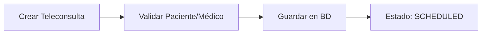
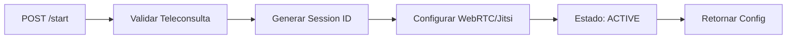
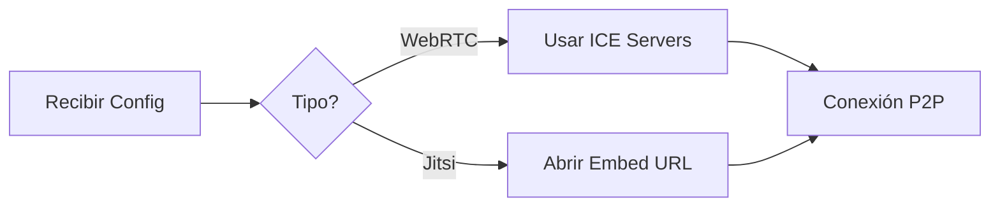

# 🎥 Módulo de Teleconsultas

## Descripción General

El módulo de teleconsultas permite realizar consultas médicas virtuales **100% gratuitas** utilizando tecnologías web estándar como WebRTC y servicios públicos como Jitsi Meet. Este módulo está diseñado para proporcionar una solución completa de telemedicina sin costos adicionales.

## 🚀 Características Principales

### ✅ **Opciones Gratuitas Implementadas**
- **WebRTC Nativo**: Conexión peer-to-peer directa entre médico y paciente
- **100% Gratuito**: Sin costos de infraestructura ni licencias
- **Sin límites**: No hay restricciones de tiempo o número de usuarios
- **Seguridad**: Encriptación end-to-end automática

### 🔧 **Funcionalidades**
- Programación de teleconsultas
- Inicio de sesiones de video en tiempo real
- Gestión de estados de consulta
- Integración con citas médicas existentes
- Soporte para consultas de emergencia
- Historial completo de teleconsultas

## 📋 Endpoints Disponibles

### **POST /teleconsultation**
Crear una nueva teleconsulta programada.

**Request Body:**
```json
{
  "patientId": 1,
  "medicId": 2,
  "appointmentId": 5,
  "scheduledAt": "2024-01-15T10:00:00Z",
  "type": "webrtc",
  "notes": "Consulta de seguimiento",
  "emergencyReason": null
}
```

**Response:**
```json
{
  "success": true,
  "message": "Teleconsulta creada exitosamente",
  "data": {
    "id": 1,
    "patientId": 1,
    "medicId": 2,
    "scheduledAt": "2024-01-15T10:00:00Z",
    "status": "scheduled",
    "type": "webrtc",
    "patient": {
      "ID_Patients": 1,
      "name": "Juan Pérez",
      "email": "juan@email.com"
    },
    "medic": {
      "ID_medics": 2,
      "name": "Dr. María González",
      "specialty": "Cardiología"
    }
  }
}
```

### **POST /teleconsultation/start** ⭐
Iniciar una sesión de teleconsulta (endpoint principal solicitado).

**Request Body:**
```json
{
  "teleconsultationId": 1,
  "preferredType": "webrtc",
  "deviceInfo": "Chrome 120.0 - Windows 11"
}
```

**Response WebRTC:**
```json
{
  "success": true,
  "message": "Sesión de teleconsulta iniciada",
  "data": {
    "sessionId": "uuid-session-123",
    "roomId": "room-1-1705320000000",
    "type": "webrtc",
    "webrtcConfig": {
      "iceServers": [
        { "urls": "stun:stun.l.google.com:19302" },
        { "urls": "stun:stun1.l.google.com:19302" }
      ],
      "constraints": {
        "video": {
          "width": { "min": 640, "ideal": 1280, "max": 1920 },
          "height": { "min": 480, "ideal": 720, "max": 1080 }
        },
        "audio": {
          "echoCancellation": true,
          "noiseSuppression": true
        }
      }
    },
    "expiresAt": "2024-01-15T12:00:00Z"
  }
}
```

**Response Emergency:**
```json
{
  "success": true,
  "message": "Sesión de teleconsulta iniciada",
  "data": {
    "sessionId": "uuid-session-456",
    "roomId": "room-1-1705320000000",
    "type": "emergency",
    "webrtcConfig": {
      "iceServers": [
        { "urls": "stun:stun.l.google.com:19302" }
      ],
      "constraints": {
        "video": { "width": { "ideal": 1280 }, "height": { "ideal": 720 } },
        "audio": { "echoCancellation": true, "noiseSuppression": true }
      }
    },
    "expiresAt": "2024-01-15T12:00:00Z"
  }
}
```

### **GET /teleconsultation/:id** ⭐
Obtener detalles de una teleconsulta (endpoint principal solicitado).

**Response:**
```json
{
  "success": true,
  "message": "Detalles de teleconsulta obtenidos",
  "data": {
    "id": 1,
    "patientId": 1,
    "medicId": 2,
    "scheduledAt": "2024-01-15T10:00:00Z",
    "startedAt": "2024-01-15T10:05:00Z",
    "status": "active",
    "type": "webrtc",
    "sessionId": "uuid-session-123",
    "roomId": "room-1-1705320000000",
    "patient": {
      "ID_Patients": 1,
      "name": "Juan Pérez",
      "email": "juan@email.com",
      "phone": "+1234567890"
    },
    "medic": {
      "ID_medics": 2,
      "name": "Dr. María González",
      "specialty": "Cardiología",
      "email": "maria@hospital.com"
    },
    "appointment": {
      "ID_Appointments": 5,
      "date": "2024-01-15",
      "time": "10:00",
      "status": "confirmed"
    }
  }
}
```

### **PATCH /teleconsultation/:id/end**
Finalizar una sesión de teleconsulta.

### **GET /teleconsultation/medic/:medicId**
Obtener teleconsultas por médico.

### **GET /teleconsultation/patient/:patientId**
Obtener teleconsultas por paciente.

## 🔄 Flujo de Funcionamiento

### 1. **Programación de Teleconsulta**


### 2. **Inicio de Sesión**


### 3. **Conexión del Cliente**


## 🛠️ Implementación Técnica

### **Arquitectura**
- **Controlador**: Maneja endpoints REST
- **Servicio**: Lógica de negocio y configuraciones
- **DTOs**: Validación de datos de entrada
- **Base de Datos**: Persistencia con Prisma

### **Tecnologías Utilizadas**
- **WebRTC**: API nativa del navegador para video/audio
- **STUN Servers**: Servidores públicos gratuitos de Google
- **UUID**: Generación de IDs únicos para sesiones

### **WebRTC (Única Tecnología)**
- Conexión peer-to-peer directa
- Encriptación automática end-to-end
- Servidores STUN públicos gratuitos de Google
- Calidad de video HD sin límites de tiempo
- Compatible con todos los navegadores modernos
- Sin instalaciones adicionales requeridas

### **Configuración WebRTC Gratuita**
```typescript
{
  iceServers: [
    { urls: 'stun:stun.l.google.com:19302' },
    { urls: 'stun:stun1.l.google.com:19302' },
    { urls: 'stun:stun2.l.google.com:19302' },
    { urls: 'stun:stunprotocol.org:3478' }
  ]
}
```

### **Configuración Jitsi Gratuita**
```typescript
{
  domain: 'meet.jit.si', // Servidor público gratuito
  roomName: 'salud-nc-{roomId}',
  embedUrl: 'https://meet.jit.si/{roomName}?config.prejoinPageEnabled=false'
}
```

## 📊 Estados de Teleconsulta

| Estado | Descripción |
|--------|-------------|
| `SCHEDULED` | Teleconsulta programada |
| `ACTIVE` | Sesión WebRTC en curso |
| `COMPLETED` | Consulta finalizada |
| `CANCELLED` | Consulta cancelada |
| `FAILED` | Error en la conexión |

## 🔒 Seguridad

### **Medidas Implementadas**
- Validación de permisos de acceso
- Encriptación automática WebRTC
- Tokens de sesión con expiración (2 horas)
- Validación de datos de entrada
- Logs de auditoría

### **Consideraciones**
- Las sesiones expiran automáticamente
- Solo participantes autorizados pueden unirse
- Datos sensibles no se almacenan en logs

## 🚀 Casos de Uso

### **1. Consulta Médica Regular**
```bash
# 1. Crear teleconsulta
curl -X POST http://localhost:3000/teleconsultation \
  -H "Content-Type: application/json" \
  -d '{
    "patientId": 1,
    "medicId": 2,
    "scheduledAt": "2024-01-15T10:00:00Z",
    "type": "webrtc"
  }'

# 2. Iniciar sesión
curl -X POST http://localhost:3000/teleconsultation/start \
  -H "Content-Type: application/json" \
  -d '{
    "teleconsultationId": 1,
    "preferredType": "webrtc"
  }'
```

### **2. Consulta de Emergencia**
```bash
curl -X POST http://localhost:3000/teleconsultation \
  -H "Content-Type: application/json" \
  -d '{
    "patientId": 1,
    "medicId": 2,
    "scheduledAt": "2024-01-15T09:00:00Z",
    "type": "emergency",
    "emergencyReason": "Dolor en el pecho"
  }'
```

## 📈 Ventajas de la Implementación

### **💰 Económicas**
- **Costo cero** en infraestructura de video
- Sin licencias de software
- Escalabilidad sin costos adicionales

### **🔧 Técnicas**
- Integración nativa con navegadores modernos
- Fallback automático a Jitsi si WebRTC falla
- Compatible con dispositivos móviles

### **👥 Experiencia de Usuario**
- Inicio rápido de sesiones
- Calidad de video/audio profesional
- Interfaz intuitiva

## 🔧 Configuración y Dependencias

### **Dependencias Instaladas**
```json
{
  "uuid": "^9.0.0",
  "@types/uuid": "^9.0.0"
}
```

### **Variables de Entorno**
No se requieren variables adicionales para las funciones básicas.

## 🧪 Pruebas

### **Endpoints de Prueba**
```bash
# Verificar salud del módulo
GET /teleconsultation/medic/1

# Crear teleconsulta de prueba
POST /teleconsultation
```

## 🔮 Extensiones Futuras

- Grabación de sesiones (opcional)
- Chat en tiempo real durante la consulta
- Compartir pantalla para mostrar documentos
- Integración con calendarios externos
- Notificaciones push para recordatorios

---

## 📝 Notas de Desarrollo

Este módulo está diseñado siguiendo las mejores prácticas de desarrollo backend:
- Código limpio y mantenible
- Manejo robusto de errores
- Logging detallado para debugging
- Validaciones exhaustivas
- Documentación completa

La implementación prioriza la **gratuidad** y **simplicidad** sin comprometer la **calidad** y **seguridad** de las teleconsultas médicas.